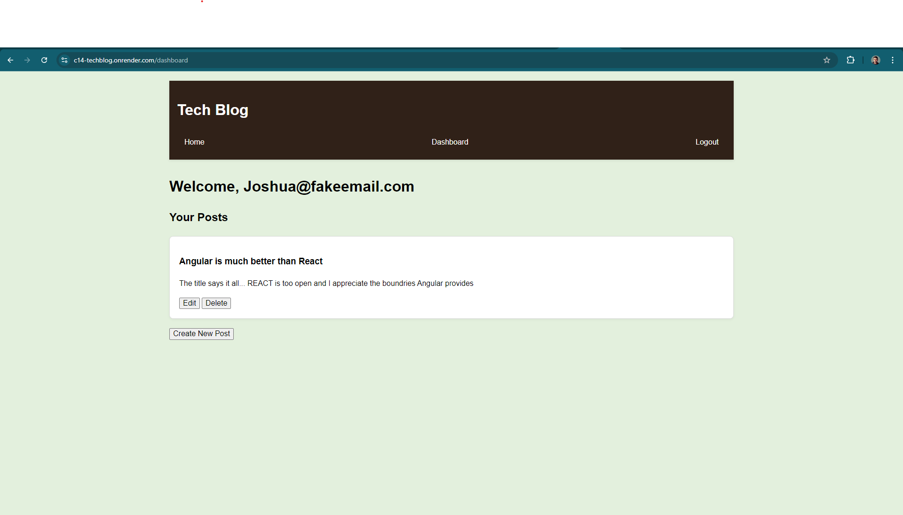
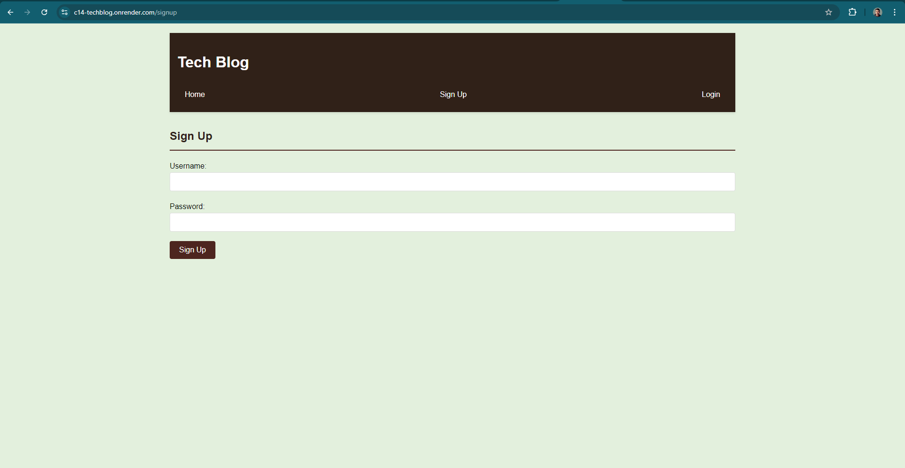

# Tech Blog

Tech Blog is a CMS-style blog site where developers can publish their posts and comment on others' posts. This project is built using Node.js, Express.js, Sequelize, Handlebars.js, and features user authentication.

## Table of Contents

- [Features](#features)
- [Technologies Used](#technologies-used)
- [Environment Variables](#environment-variables)
- [Usage](#usage)
- [Live Deployment](#live-deployment)
- [Local Deployment](#local-deployment)
- [Example](#example)
- [License](#license)
- [Source Code](#source-code)

## Features

- User Authentication: Sign up, log in, and log out.
- Post Management: Create, update, and delete posts.
- Comment System: Comment on posts and view comments.
- Responsive Design: Optimized for desktop and mobile devices.

## Technologies Used

- Node.js
- Express.js
- Sequelize (PostgreSQL)
- Handlebars.js
- Express-Session for user authentication
- bcrypt for password hashing

## Environment Variables

DB_NAME='your_database_name'
DB_USER='your_database_user'
DB_PASSWORD='your_database_password'
DB_URL='' # Optional, if you use a different method to connect to the database
SESSION_SECRET='your_secret_key'

## Usage

### Live Deployment

1. Open the application via this [Link to the application](https://c14-techblog.onrender.com/).
2. Create an account or log in to an existing account.
3. Create, read, update, and delete blog posts.
4. Comment on blog posts.
5. Explore the application and enjoy!

### Local Development

1. Clone the repository
2. Install dependencies: `npm install`
3. Set up your PostgreSQL database by using the `schema.sql` and update `.env` file
4. Run seeds: `npm run seed`
5. Start the server: `npm start`
6. Visit `http://localhost:3001` in your browser

## Example(s)

[Deployed Tech Blog](https://c14-techblog.onrender.com) <-- Deployed Tech Blog

## Source Code

- Created by [Mountainmaincodes](https://github.com/Mountainmancodes)
- Code Assistance:
  - [Lixiviate](https://github.com/Lixiviate)
  - [MDN Web Docs](https://developer.mozilla.org/en-US/)
  - [edX Xpert Learning Assistant](https://www.edx.org/)
  - [Render](https://community.render.com/t/why-am-i-getting-this-error-while-deploying-backend/19177/5)
  - [AskBSC](https://utavirtfsfpt0-ys73309.slack.com/archives/D0720EK1P9V)

## License

This project is licensed under the MIT license.
